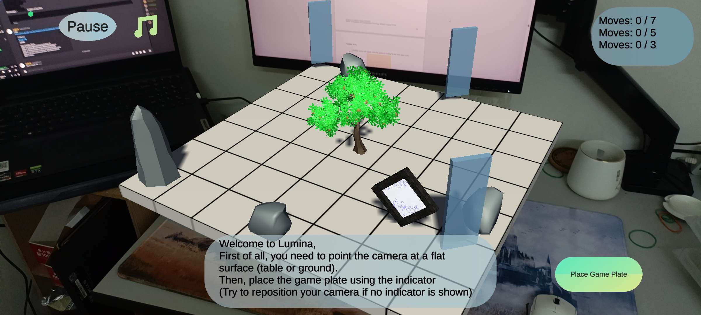
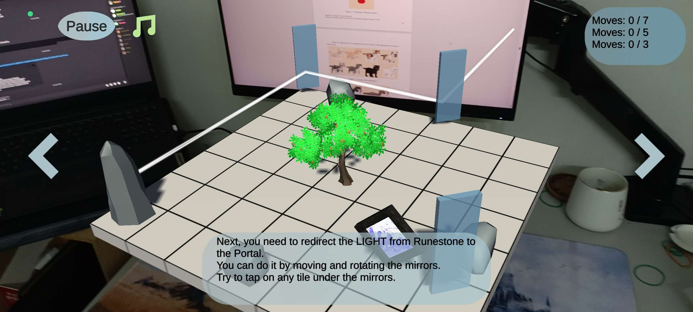
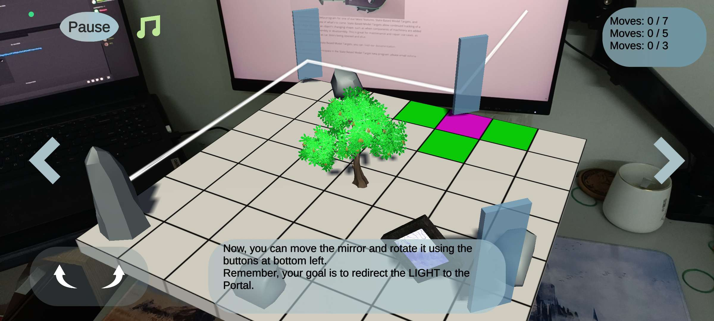

# Lumina

**Lumina** is an augmented reality (AR) based mobile puzzle game where players use light reflection mechanics to solve puzzles by redirecting a light beam to a portal (end point) by moving or rotating mirrors on a game plate.

**This project is purely for academic use, which is my final year project (FYP) in bachelor degree of computer science. All of the assets used are free resources from Internet.**

## 🎮 Features

- **AR-based Gameplay**: Utilizes AR technology to overlay virtual puzzles onto real-world environments.
- **Light Reflection Mechanics**: Players solve puzzles by strategically reflecting light using mirrors.
- **Challenging Levels**: A diverse range of puzzles that increase in difficulty.
- **Immersive Experience**: Combines AR with engaging sound effects and intuitive controls.

## 🚀 Getting Started

### Prerequisites

To run Lumina, ensure you have the following:
- An AR-supported mobile device (iOS or Android)
- Unity 3D (for development purposes)
- [Vuforia Engine](https://developer.vuforia.com/) (for AR capabilities)

### Installation

1. **Clone the Repository**:
   ```bash
   git clone https://github.com/yourusername/lumina.git
   cd lumina

2. **Open in Unity:**

- Open the project folder in Unity.
- Make sure the Vuforia package is installed and configured.

3. **Build and Deploy:**

- Choose your target platform (iOS or Android).
- Follow Unity's instructions to build and deploy the app to your device.

## 🕹️ How to Play

- **Start the Game**: Launch the app on your mobile device.
- **Place the Game Plate**: Use your device's camera to scan a flat surface.
- **Solve Puzzles**: Rotate and move mirrors to direct the light beam to the portal.
- **Progress Through Levels**: Complete each level to unlock the next one.

## 📸 Screenshots and Video





<video width="640" height="360" controls>
  <source src="demo/demo.mp4" type="video/mp4">
  Your browser does not support the video tag.
</video>

## 📂 Project Structure

- **Assets**: All game assets, including scripts, models, textures, and sounds.
- **Packages**: External packages used, such as Vuforia.
- **Builds**: Instructions and configurations for building the game.
